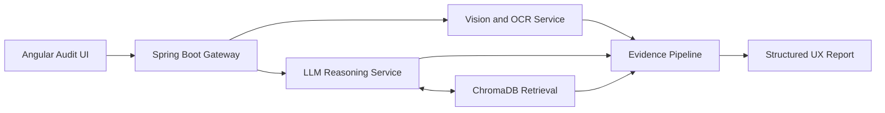

<!-- Profile README draft for github.com/YACINBK -->

  

  

  
  
  
  
  

  

  

  

I am **Yacin Ben Kacem**, an Applied Computer Science Engineering student at **ENISo** who likes building AI products that feel engineered, not improvised. What pulls me in is the part around the model: the retrieval layer, the backend contracts, the evidence pipeline, the report structure, and the interface that makes the result useful.

Most of my work starts with a messy real-world input and ends with a structured output someone can actually act on. That is why I keep coming back to multi-service architecture, secure backend flows, OCR and computer vision, UX analysis, and automation that can survive beyond the demo phase.

- I build products as complete systems, not isolated AI prompts.
- I care about interfaces that feel sharp, readable, and intentional.
- I take security seriously from the start: identity, tokens, validation, and access control.
- I like turning screenshots, documents, and noisy inputs into structured outputs.

  

### UX Insight Platform

This is the public system that currently represents me best: a containerized UX analysis platform designed to turn screenshots and interface evidence into structured recommendations for product, design, and engineering teams.

- Angular frontend for guided audit flows
- Spring Boot gateway for orchestration
- FastAPI services for LLM reasoning and computer vision
- ChromaDB retrieval for pattern matching and context enrichment
- Report-ready outputs instead of vague AI summaries

  

  
  
  
  
  
  
  
  
  
  
  
  

  
  
  
  

  <code>RAG</code>
  <code>ChromaDB</code>
  <code>YOLOv8</code>
  <code>OCR</code>
  <code>LLMOps</code>
  <code>OIDC / JWT</code>
  <code>Triton</code>
  <code>Webots</code>
  <code>Automation Pipelines</code>

  

  
  

  
  

  

Private work still says a lot about me too: secure AI productivity systems, local-inference workflows, governed content automation, and structured extraction pipelines that are not public yet.

  

  

  
  

  

  

- Applied Computer Science Engineering student at **ENISo**
- Built independent systems around LLM workflows, backend orchestration, secure delivery, and computer vision
- Internship experience at **Whitecape Technologies** around AI-assisted UX analysis, heuristic engines, RAG, and production-facing FastAPI delivery
- Ongoing learning through **NVIDIA**, **DeepLearning.AI**, and hands-on system building
- Open to internships and technical collaborations involving AI systems, backend engineering, intelligent tooling, or automation

  

  <a href="mailto:yacinbenkacem19@gmail.com">Email</a> |
  <a href="https://github.com/YACINBK">GitHub</a> |
  <a href="https://www.linkedin.com/in/yacin-ben-kacem/">LinkedIn</a> |
  <a href="https://yacinbk.github.io/portfolio">Portfolio</a>

  

