<!-- Profile README draft for github.com/YACINBK -->

<p align="center">
  
</p>

<p align="center">
  
</p>

<p align="center">
  
</p>

<p align="center">
  <a href="https://yacinbk.github.io/portfolio">
    
  </a>
  <a href="https://github.com/YACINBK">
    
  </a>
  <a href="https://www.linkedin.com/in/yacin-ben-kacem/">
    
  </a>
  <a href="mailto:yacinbenkacem19@gmail.com">
    
  </a>
  
</p>

<p align="center">
  
</p>

```bash
> whoami
Yacin Ben Kacem

> studying
Applied Computer Science Engineering @ ENISo - National School Of Engineering Of Sousse

> based_in
Monastir, Tunisia

> current_focus
AI systems, secure backends, and agentic integrations
```

I am **Yacin Ben Kacem**, an Applied Computer Science Engineering student at **ENISo**. I build AI products with a strong focus on the system around the model: backend architecture, retrieval, validation, OCR, computer vision, and outputs that are actually useful to people.

What matters most to me is clarity. I like taking messy inputs and turning them into structured systems that feel deliberate, reliable, and clean to use. That is why I keep coming back to secure backend flows, multi-service AI architecture, UX analysis, and automation that can survive beyond a demo.

- Building complete systems, not isolated prompts
- Designing interfaces that feel sharp, readable, and intentional
- Taking security seriously from the start
- Turning screenshots, documents, and noisy inputs into structured outputs

<p align="center">
  
</p>

<p align="center">
  
  
  
  
  
  
  
  
  
  
  
  
</p>

<p align="center">
  
  
  
  
</p>

<p align="center">
  <code>RAG</code>
  <code>ChromaDB</code>
  <code>YOLOv8</code>
  <code>OCR</code>
  <code>LLMOps</code>
  <code>OIDC / JWT</code>
  <code>Triton</code>
  <code>Webots</code>
  <code>Automation Pipelines</code>
</p>

<p align="center">
  
</p>

<p align="center">
  
</p>

<p align="center">
  
  
</p>

<p align="center">
  
</p>

<p align="center">
  
</p>

- Applied Computer Science Engineering student at **ENISo**
- Built independent systems around LLM workflows, backend orchestration, secure delivery, and computer vision
- Internship experience at **Whitecape Technologies** around AI-assisted UX analysis, heuristic engines, RAG, and production-facing FastAPI delivery
- Ongoing learning through **NVIDIA**, **DeepLearning.AI**, and hands-on system building
- Open to internships and technical collaborations involving AI systems, backend engineering, intelligent tooling, or automation

<p align="center">
  
</p>

<p align="center">
  <a href="mailto:yacinbenkacem19@gmail.com">
    
  </a>
  <a href="https://github.com/YACINBK">
    
  </a>
  <a href="https://www.linkedin.com/in/yacin-ben-kacem/">
    
  </a>
  <a href="https://yacinbk.github.io/portfolio">
    
  </a>
</p>

<p align="center">
  
</p>
