<!-- Profile README — github.com/YACINBK -->

<p align="center">
  
</p>

<p align="center">
  
</p>

<p align="center">
  <a href="https://yacinbenkacem.me/">
    
  </a>
  <a href="https://github.com/YACINBK">
    
  </a>
  <a href="https://www.linkedin.com/in/yacin-ben-kacem/">
    
  </a>
  <a href="mailto:yacinbenkacem19@gmail.com">
    
  </a>
</p>

<p align="center">
  
</p>

---

<p align="center">
  
</p>

```bash
> whoami
Yacin Ben Kacem

> studying
Applied Computer Science Engineering @ ENISo — National School of Engineering of Sousse

> based_in
Monastir, Tunisia

> core_focus
Agentic systems, secure backend architecture, resilient workflows, shipping under constraints
```

I am **Yacin Ben Kacem**, an Applied Computer Science Engineering student at **ENISo**. I architect secure backend systems and agentic AI workflows that survive real-world failure.

What matters most to me is that systems hold up when things go wrong: missing API key, no GPU, 400 concurrent users, unavailable external service. I treat those as **design inputs**, not edge cases.

- **Agentic Systems** — Multi-step AI workflows with state checks, tool routing, retries, and explicit failure states.
- **Secure Backend** — Gateways, identity, JWT/OIDC validation, access boundaries, and clean API contracts.
- **Resilient Workflows** — Caching, preprocessing, explicit fallbacks, reproducible outputs, and resource-aware execution.
- Treating hardware limits, performance constraints, and integration reality as part of the spec.

---

<p align="center">
  
</p>

### 🔷 [UX Insight Platform](https://github.com/YACINBK/ux-insight-platform)

> `Spring Boot` `FastAPI` `Angular` `ChromaDB` `OCR` `PostgreSQL` `Docker Compose`

A fully containerized UX analysis platform built around a clear service separation: Spring Boot acts as the API gateway, routing to two dedicated FastAPI services — one for LLM-powered heuristic and behavioral analysis backed by ChromaDB RAG with query-level caching, one for Vision/OCR. The Angular frontend consumes reports and dashboard stats from the gateway only. Provider-agnostic by design. Everything boots with `docker-compose up`.

---

### 🔷 [QuickFlow](https://github.com/TaherBenAfia/quickflow) — *Team of 4 · Security & Data Orchestration*

> `Spring Boot` `Spring AI` `Spring Security` `Ollama` `React` `MongoDB` `Whisper`

An AI productivity suite for meeting minutes and email drafting. I owned two layers:
**Authentication architecture** — email/password with bcrypt, OAuth2 via Google and Microsoft with encrypted token storage in MongoDB, SMTP fallback for non-OAuth users, JWT session management, TOTP infrastructure for MFA.
**Data orchestration** — applied caching to the Ollama inference layer to eliminate redundant model calls under concurrent load, aligned retrieval with system design rules.

---

### 🔷 [Smart City Sousse 2030 V2](https://github.com/YACINBK/smart-city-sousse-2030-V2)

> `Python` `PostgreSQL` `Streamlit` `FSM` `NL→SQL Compiler` `OpenAI-compatible`

An urban operations platform built around a French NL→SQL compiler, Finite-state machines, AI reporting, and a Streamlit operational dashboard. Dockerized, TimescaleDB-compatible schema, automated test suites. Offline capability is a first-class requirement.

---

### 🔷 [Image Vectorization Pipeline](https://github.com/YACINBK/image-vectorization)

> `Python` · local pipeline

Raster-to-vector conversion replicating the Illustrator/Photoshop vectorization workflow without the software dependency. Verbose output at every processing stage, explicit fallbacks throughout. Designed to stay fully local.

---

### 🔷 [Webots UR10 Pick-and-Place + YOLOv8](https://github.com/YACINBK/webots-ur10-pick-and-place-yolo8)

> `Python` `Webots` `YOLOv8`

YOLOv8 object detection integrated with a UR10 arm simulation in Webots, controlled by an FSM-driven pick-and-place sequence.

---

<p align="center">
  
</p>

<p align="center">
  <a href="https://skillicons.dev">
    
  </a>
</p>

<p align="center">
  <a href="https://skillicons.dev">
    
  </a>
</p>

<p align="center">
  <a href="https://skillicons.dev">
    
  </a>
</p>

<p align="center">
  
  
  
  
  
</p>

<p align="center">
  <code>RAG</code>&nbsp;
  <code>ChromaDB</code>&nbsp;
  <code>YOLOv8</code>&nbsp;
  <code>OCR</code>&nbsp;
  <code>LLMOps</code>&nbsp;
  <code>OIDC / JWT</code>&nbsp;
  <code>LoRA / QLoRA</code>&nbsp;
  <code>Triton Server</code>&nbsp;
  <code>Agentic Systems</code>&nbsp;
  <code>Automation Pipelines</code>
</p>

---

<p align="center">
  
</p>

<p align="center">
  
</p>

<p align="center">
  
  
</p>

<p align="center">
  
</p>

---

<p align="center">
  
</p>

- Applied Computer Science Engineering student at **ENISo**, Sousse
- Built production-grade systems around agentic workflows, backend orchestration, secure auth delivery, and CV pipelines
- Internship experience at **Whitecape Technologies** — AI-assisted UX analysis, heuristic engines, RAG with caching, production FastAPI delivery
- Fine-tuning open-source models with **LoRA/QLoRA + quantization** on an RTX 4060; local serving via Ollama and Triton Server
- Active **Zindi competitor** — 31st/69 at IndabaX Tunisia 2025 (soil nutrient prediction)
- Open to internships and technical collaborations in AI systems, backend engineering, intelligent tooling, or automation

---

<p align="center">
  
</p>

<p align="center">
  <a href="mailto:yacinbenkacem19@gmail.com">
    
  </a>
  <a href="https://github.com/YACINBK">
    
  </a>
  <a href="https://www.linkedin.com/in/yacin-ben-kacem/">
    
  </a>
  <a href="https://yacinbenkacem.me/">
    
  </a>
</p>

<p align="center">
  
</p>